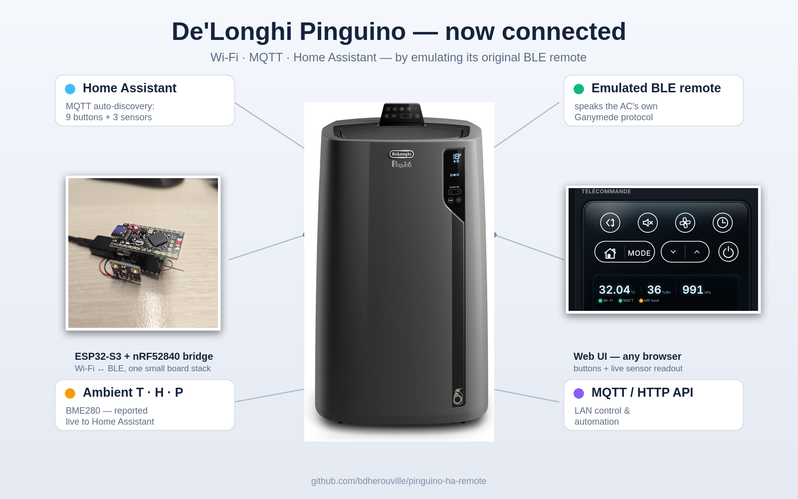
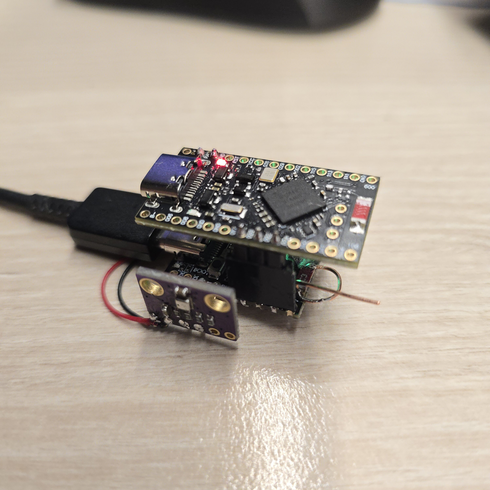

# this fork removes the need for the nrf using just the esp32 for this. 


# pinguino-ha-remote



Control a **De'Longhi Pinguino air-conditioner** from your LAN / Home Assistant by
**emulating its manual BLE remote**. Commands from the web UI, MQTT, or Home Assistant bond
with the AC and **change its state on-air** — no cloud, no IR blaster.

**Status:** working end-to-end. `power`, `up`, `down`, `mode`, `eco`, `timer`, `fan`,
`silent`, `flap` all act on the AC.

## What you get

Two small boards in a stack, plus an optional sensor:

```
HA / LAN ──MQTT/HTTP──► ESP32-S3 ──UART──► nRF52840 ──BLE──► AC
```

- **nRF52840** — the BLE radio: emulates the remote, bonds with the AC.
- **ESP32-S3** — the Wi-Fi bridge: web UI, MQTT, Home Assistant.
- **BME280** — ambient temperature / humidity / pressure (optional), reported to HA.

The BLE has to live on the nRF — the ESP32's radio can't pass the AC's pairing gate. Why, and
the full protocol, is in [`docs/ganymede_protocol.md`](docs/ganymede_protocol.md).

## Bill of materials

| Qty | Part | Role | Source |
|-----|------|------|--------|
| 1 | **ESP32-S3 SuperMini** (ESP32-S3FH4R2) | Wi-Fi bridge | [AliExpress](https://fr.aliexpress.com/item/1005008807808123.html) |
| 1 | **nRF52840 SuperMini** (nice!nano-v2-compatible) | BLE emulator | [AliExpress](https://fr.aliexpress.com/item/1005008099333183.html) |
| 1 | **BME280 / BMP280** module | ambient T/H/P (optional) | [AliExpress](https://fr.aliexpress.com/item/1005007527106667.html) |
| — | USB cables + jumper wires | power & wiring | — |

*(Reverse-engineering the protocol yourself needs a second nRF52840 as a sniffer — see
[`tools/nrf_sniffer/`](tools/nrf_sniffer/README.md). A working deployment doesn't.)*

| | |
|---|---|
|  |  |
| nRF52840 emulator + ESP32-S3 bridge + BME280 | Powered: red = nRF, green = ESP32-S3 |

## Get a working unit

Prebuilt binaries are attached to every
[**release**](https://github.com/bdherouville/pinguino-ha-remote/releases/latest). Each board
can be flashed from the release **or** built locally — full steps in the per-board READMEs.

### 1 · Flash the nRF52840 (BLE emulator)

These boards have **no reset button** — enter the bootloader by bridging the **RST↔GND pads
twice** (a USB drive `NICENANO` appears), then drag a `.uf2` onto it.

1. **Upgrade the bootloader once** (required): drag `update-nice_nano_bootloader-0.9.2_nosd.uf2`
   (from the release) — boards ship with an old bootloader that won't boot our app.
2. **Flash the app**: re-enter the bootloader, drag `ganymede-emulator-nrf52840.uf2`.

Details / local build / cloning a specific remote address →
[`firmware/nrf52_emulator/README.md`](firmware/nrf52_emulator/README.md).

### 2 · Flash the ESP32-S3 (Wi-Fi bridge)

- **Browser:** open the [web flasher](https://bdherouville.github.io/pinguino-ha-remote/flash/)
  (Chrome/Edge), plug in, **Install**.
- **CLI:** `esptool --chip esp32s3 -p <PORT> write_flash 0x0 ganymede-bridge-esp32s3.bin`

Details / local build → [`firmware/esp32_bridge/README.md`](firmware/esp32_bridge/README.md).

### 3 · Wire the two boards

```
ESP32-S3            nRF52840                 ESP32-S3        BME280 (optional)
  GPIO4 (TX) ─────► P0.20 (RX)                 GPIO1 (SCL) ─► SCL
  GPIO5 (RX) ◄───── P0.22 (TX)                 GPIO2 (SDA) ◄► SDA
  GPIO6 (HB) ◄───── P0.24 (heartbeat)          GND ───────── GND
  GND ───────────── GND
```
115200 8N1. Pinouts and board quirks: [`docs/HARDWARE.md`](docs/HARDWARE.md).

### 4 · Connect the bridge to Wi-Fi

On first boot the ESP32 raises an open AP **`Ganymede-Bridge`** → connect → open
`http://192.168.4.1` → pick your Wi-Fi → (optional) set your **MQTT broker** for Home Assistant.

### 5 · Pair with the AC

The emulator behaves like a real remote: with **no bond** it automatically advertises in
**pairing mode** (Limited Discoverable) as `Ganymede` — no button needed.

1. Put the **AC** in pairing mode (Make sure **AC is plugged in and turned off**, then **hold MODE ~10 s**; its display dot blinks rapidly).
3. They bond within ~60 s. The bridge LED goes **green** = ready to relay.

That's it — it **pairs, unpairs, re-pairs, and switches with the original remote exactly like a
physical remote**, so the address doesn't matter (the prebuilt generic binary works as-is).

### 6 · Control it

Use the bridge **web UI**, **Home Assistant** (9 buttons + 3 sensors auto-discovered over
MQTT), or publish to `ganymede/cmd/<button>`.

## Documentation

- [**Protocol & reverse engineering**](docs/ganymede_protocol.md) — identity, advertising,
  GATT, button reports, the link-layer pairing gate, SMP, and how it was reverse-engineered.
- [**Hardware & build notes**](docs/HARDWARE.md) — board gotchas (clock, bootloader, flash
  offset), pinouts, why the BLE lives on the nRF.
- [**Releasing**](RELEASING.md) — how CI builds and publishes the binaries.
- Firmware: [ESP32-S3 bridge](firmware/esp32_bridge/README.md) ·
  [nRF52840 emulator](firmware/nrf52_emulator/README.md) ·
  [nRF Sniffer](tools/nrf_sniffer/README.md).

## License

[MIT](LICENSE) for this project's code and docs. Third-party components (Nordic nRF Sniffer,
ESP-IDF managed components, the NimBLE reference) keep their upstream licenses.
